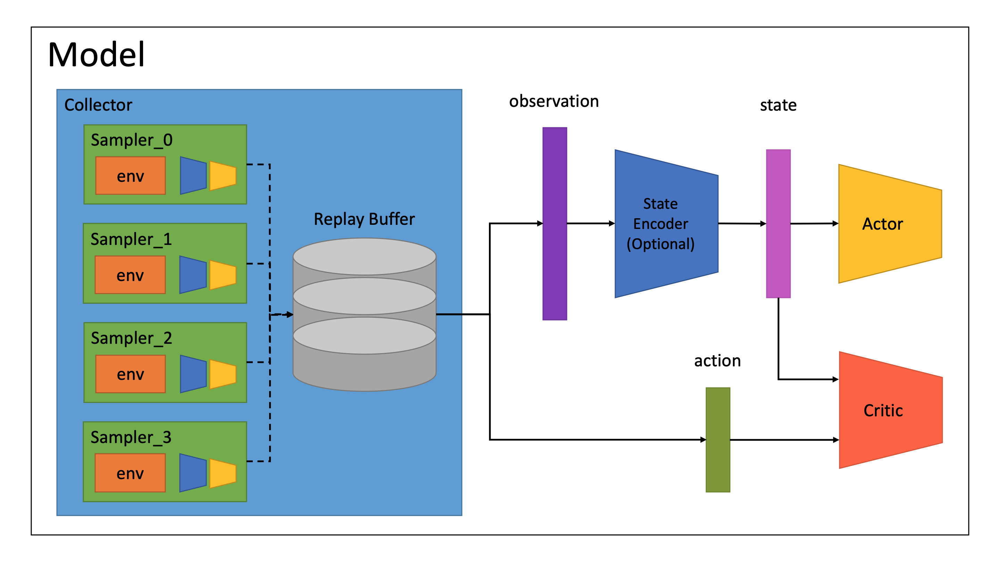

# Soft-Actor-Critic
PyTorch Implementation of Soft Actor-Critic Algorithm

Reference: Soft Actor-Critic Algorithms and Applications ([https://arxiv.org/pdf/1812.05905.pdf](https://arxiv.org/pdf/1812.05905.pdf))

# Main Features

- fully customizable network structure
- parallel data sampling
- comprehensive logging
- good performance

# Requirements

- [PyTorch](https://pytorch.org/)
- [TensorBoard](https://www.tensorflow.org/tensorboard/)
- [Gym](http://gym.openai.com/)
- [PyBullet](https://pybullet.org/wordpress/)

# Architecture



# Usage

```bash
# clone the repo
git clone https://github.com/XuehaiPan/Soft-Actor-Critic.git
cd Soft-Actor-Critic

# install dependencies
pip3 install -r requirements.txt

# modify hyperparameters before running
# train/test FC controller without state encoder
bash scripts/train_identity.sh
bash scripts/test_identity.sh
# override arguments in script file
bash scripts/train_identity.sh --env "BipedalWalker-v3" --n-epochs 5000

# train/test FC controller with FC state encoder
bash scripts/train_fc.sh
bash scripts/test_fc.sh

# train/test FC controller with RNN state encoder
bash scripts/train_rnn.sh
bash scripts/test_rnn.sh

# train/test FC controller with CNN state encoder
bash scripts/train_cnn.sh
bash scripts/test_cnn.sh

# for device arguments
# train and sample on 'cuda:0'
bash scripts/train_identity.sh --gpu --n-samplers 4
# train on 'cuda:0' and sample on ('cuda:1', 'cuda:2', 'cuda:3', 'cuda:4')
bash scripts/train_identity.sh --gpu 0 1 2 3 4 --n-samplers 4
# train on 'cuda:0' and sample on ('cuda:1', 'cuda:2', 'cuda:0', 'cuda:1')
bash scripts/train_identity.sh --gpu 0 1 2 --n-samplers 4
# train on 'cuda:0' and sample on ('cuda:1', 'cuda:2', 'cuda:1', 'cuda:2')
bash scripts/train_identity.sh --gpu 0 1 2 1 2 --n-samplers 4
# train on 'cuda:0' and sample on ('cuda:1', 'cuda:2', 'cpu', 'cpu')
bash scripts/train_identity.sh --gpu 0 1 2 c c --n-samplers 4
```

You can use `python3 main.py --help` for more details:
```
usage: main.py [-h] [--mode {train,test}]
               [--gpu CUDA_DEVICE [CUDA_DEVICE ...]] [--env ENV]
               [--n-frames N_FRAMES] [--render] [--vision-observation]
               [--image-size SIZE] [--hidden-dims DIM [DIM ...]]
               [--activation {ReLU,LeakyReLU}] [--encoder-arch {FC,RNN,CNN}]
               [--state-dim DIM] [--encoder-activation ACTIVATION]
               [--encoder-hidden-dims DIM [DIM ...]]
               [--encoder-hidden-dims-before-rnn DIM [DIM ...]]
               [--encoder-hidden-dims-rnn DIM [DIM ...]]
               [--encoder-hidden-dims-after-rnn DIM [DIM ...]]
               [--skip-connection] [--trainable-hidden]
               [--step-size STEP_SIZE]
               [--encoder-hidden-channels CHN [CHN ...]]
               [--kernel-sizes K [K ...]] [--strides S [S ...]]
               [--paddings P [P ...]] [--poolings K [K ...]]
               [--batch-normalization] [--max-episode-steps MAX_EPISODE_STEPS]
               [--n-epochs N_EPOCHS] [--n-episodes N_EPISODES]
               [--n-updates N_UPDATES] [--batch-size BATCH_SIZE]
               [--n-samplers N_SAMPLERS] [--buffer-capacity CAPACITY]
               [--update-sample-ratio RATIO] [--gamma GAMMA] [--soft-tau TAU]
               [--normalize-rewards] [--reward-scale SCALE] [--deterministic]
               [--lr LR] [--critic-lr CRITIC_LR] [--actor-lr ACTOR_LR]
               [--alpha-lr ALPHA_LR] [--initial-alpha ALPHA]
               [--adaptive-entropy] [--weight-decay WEIGHT_DECAY]
               [--clip-gradient] [--random-seed SEED] [--log-episode-video]
               [--log-dir LOG_DIR] [--checkpoint-dir CHECKPOINT_DIR]
               [--load-checkpoint]

Train or test Soft Actor-Critic controller.

optional arguments:
  -h, --help            show this help message and exit
  --mode {train,test}   mode (default: train)
  --gpu CUDA_DEVICE [CUDA_DEVICE ...]
                        GPU device indexes (int for CUDA device or 'c'/'cpu'
                        for CPU) (use 'cuda:0' if no following arguments; use
                        CPU if not present)
  --env ENV             environment to train on (default: Pendulum-v0)
  --n-frames N_FRAMES   concatenate original N consecutive observations as a
                        new observation (default: 1)
  --render              render the environment
  --vision-observation  use rendered images as observation
  --image-size SIZE     image size of vision observation (default: 96)
  --hidden-dims DIM [DIM ...]
                        hidden dimensions of FC controller
  --activation {ReLU,LeakyReLU}
                        activation function in controller networks (default:
                        ReLU)
  --max-episode-steps MAX_EPISODE_STEPS
                        max steps per episode (default: 10000)
  --n-epochs N_EPOCHS   number of training epochs (default: 1000)
  --n-episodes N_EPISODES
                        number of test episodes (default: 100)
  --n-updates N_UPDATES
                        number of learning updates per epoch (default: 256)
  --batch-size BATCH_SIZE
                        batch size (default: 256)
  --n-samplers N_SAMPLERS
                        number of parallel samplers (default: 4)
  --buffer-capacity CAPACITY
                        capacity of replay buffer (default: 1000000)
  --update-sample-ratio RATIO
                        speed ratio of training and sampling (sample speed <=
                        training speed / ratio (ratio should be larger than
                        1.0)) (default: 2.0)
  --gamma GAMMA         discount factor for rewards (default: 0.99)
  --soft-tau TAU        soft update factor for target networks (default: 0.01)
  --normalize-rewards   normalize rewards for training
  --reward-scale SCALE  reward scale factor for normalized rewards (default:
                        1.0)
  --deterministic       deterministic in evaluation
  --weight-decay WEIGHT_DECAY
                        weight decay (default: 0.0)
  --clip-gradient       clip gradient on optimizer step
  --random-seed SEED    random seed (default: 0)
  --log-episode-video   save rendered episode videos to TensorBoard logs
  --log-dir LOG_DIR     folder to save TensorBoard logs
  --checkpoint-dir CHECKPOINT_DIR
                        folder to save checkpoint
  --load-checkpoint     load latest checkpoint in checkpoint dir

state encoder:
  --encoder-arch {FC,RNN,CNN}
                        architecture of state encoder network (default: FC)
  --state-dim DIM       target state dimension of encoded state (use
                        env.observation_space.shape if not present)
  --encoder-activation ACTIVATION
                        activation function in state encoder networks (use
                        activation function in controller if not present)

FC state encoder:
  --encoder-hidden-dims DIM [DIM ...]
                        hidden dimensions of FC state encoder

RNN state encoder:
  --encoder-hidden-dims-before-rnn DIM [DIM ...]
                        hidden FC dimensions before GRU layers in RNN state
                        encoder
  --encoder-hidden-dims-rnn DIM [DIM ...]
                        GRU hidden dimensions of RNN state encoder
  --encoder-hidden-dims-after-rnn DIM [DIM ...]
                        hidden FC dimensions after GRU layers in RNN state
                        encoder
  --skip-connection     add skip connection beside GRU layers in RNN state
                        encoder
  --trainable-hidden    set initial hidden of GRU layers trainable (use zeros
                        as initial hidden if not present)
  --step-size STEP_SIZE
                        number of continuous steps for update (default: 16)

CNN state encoder:
  --encoder-hidden-channels CHN [CHN ...]
                        channels of hidden conv layers in CNN state encoder
  --kernel-sizes K [K ...]
                        kernel sizes of conv layers in CNN state encoder
                        (defaults: 3)
  --strides S [S ...]   strides of conv layers in CNN state encoder (defaults:
                        1)
  --paddings P [P ...]  paddings of conv layers in CNN state encoder
                        (defaults: K // 2)
  --poolings K [K ...]  max pooling kernel size after activation function in
                        CNN state encoder (defaults: 1)
  --batch-normalization
                        use batch normalization in CNN state encoder

learning rate:
  --lr LR               learning rate (can be override by the following
                        specific learning rate) (default: 0.0001)
  --critic-lr CRITIC_LR
                        learning rate for critic networks (use LR above if not
                        present)
  --actor-lr ACTOR_LR   learning rate for actor networks (use LR above if not
                        present)

temperature parameter:
  --alpha-lr ALPHA_LR   learning rate for temperature parameter (use ACTOR_LR
                        above if not present)
  --initial-alpha ALPHA
                        initial value of temperature parameter (default: 1.0)
  --adaptive-entropy    auto update temperature parameter while training
```
